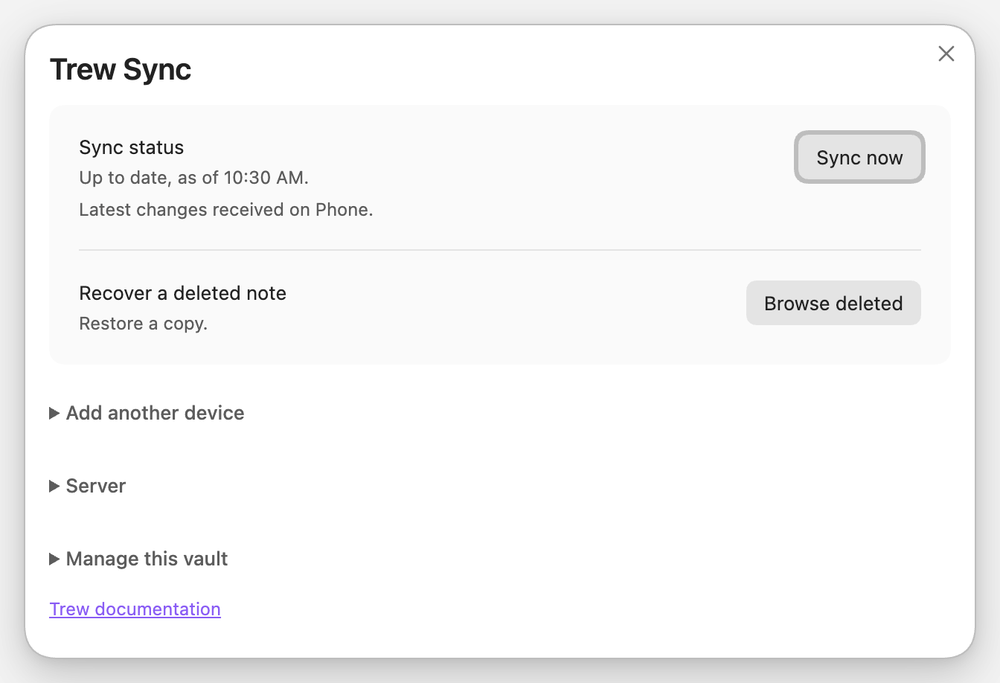

#  TrewSync

**Your own Obsidian sync, with an agent inside it.**

TrewSync syncs your vault through a server you run, keeps every earlier
version of every note, and lets an agent such as Claude Code read and edit the
same notes your devices sync, with every agent edit recorded and undoable.

[](https://github.com/waynehoover/trewsync/actions/workflows/ci.yml)
[](https://www.npmjs.com/package/trew-sync)
[](LICENSE)

**[Quickstart](#quickstart)** · [Download](https://github.com/waynehoover/trewsync/releases) · [Docs](docs/index.md) · [Connect an agent](docs/agent.md) · [How it compares](docs/compared.md)

<picture>
  <source media="(prefers-color-scheme: dark)" srcset="docs/assets/screenshots/panel-dark.png">
  
</picture>

## Quickstart

You need a Linux or macOS machine with Docker and local storage, and
[Tailscale](https://tailscale.com) on it and on each device. Back up an
existing vault before its first sync, and turn off any other sync service for
it.

1. **Run the server.**

   ```bash
   git clone https://github.com/waynehoover/trewsync.git && cd trewsync
   docker compose up -d
   ```

2. **Give it a secure address.** `tailscale serve --bg 3003` publishes it to
   your tailnet over HTTPS. Take the address `tailscale serve status` reports
   and replace `https://` with `wss://`, for example
   `wss://homelab.example.ts.net`.

3. **Make an invite for your first device**, naming that address:

   ```bash
   docker compose exec trew /trewd invite -url wss://homelab.example.ts.net
   ```

   An invite works once and expires after one hour, so make it when you are
   ready to pair.

4. **Install the plugin and pair.** Download `main.js`, `manifest.json` and
   `styles.css` from the newest plugin
   [release](https://github.com/waynehoover/trewsync/releases) into
   `<vault>/.obsidian/plugins/trew-sync/`, reload Obsidian and enable
   **TrewSync**. Paste the invite, check the server it names, and press
   **Pair**. Keep Obsidian open until the first sync finishes; on Android it
   has to stay in the foreground.

5. **Add your other devices.** On the paired device choose **Add another device
   → Create invite**, then scan the QR code with the next one.

To let an agent in, start the server with `-mcp`, make a token with
`trewd mcp-token -label "Claude on Mac"`, and give the client
`https://homelab.example.ts.net/mcp` with that token as a bearer.
[Connect an agent](docs/agent.md) has the details, and why to start read-only.

Prefer to have your agent do the setup? Give it [llm.md](llm.md). The full
walk-through, including Caddy instead of Tailscale and a binary instead of
Docker, is [server setup](docs/server.md).

## What you get

- **An agent inside your sync.** The server has an MCP endpoint built in. An
  agent reads, searches and compares versions over the same store your
  devices sync, with no second copy of the vault to keep in step.
- **Agent edits you can undo.** An agent changes notes only by exact edits
  against the version it read, never by overwriting a whole note. Every write
  is recorded, keeps what it replaced for at least 30 days, and can be undone
  from Obsidian, from the server, or by the agent.
- **Every version kept.** Browse a note's history, compare versions, and
  restore deleted notes, inside Obsidian. Restoring writes a copy beside the
  note rather than over it.
- **Conflicts keep both.** TrewSync combines edits when its merge checks pass
  and keeps both versions when they do not, in a copy named after whoever
  wrote it: another device, or the agent.
- **Pair by QR code.** Scan it, or paste a pairing code. There is no fixed
  device limit, and a lost device is revoked from another one or from the
  server.
- **No key to lose.** The notes and their history live on the server, so
  losing every device loses no synced note: the server pairs a new one.
- **A mirror without Obsidian.** The [command-line client](docs/client.md)
  keeps a copy on a NAS or another machine, read-only or two-way.
- **A Git history, if you want one.** The server can keep the vault's history
  in Git and push it to a private repository: one commit per agent change and
  per quiet run of a device's edits, large attachments in Git LFS, never read
  back ([Keep a Git history](docs/git-export.md)).
- **Small to run.** One static binary, or a small container with Git beside
  it for the export, SQLite inside, no database service beside it. Edits
  upload only the changed pieces of a file.

## Before you choose TrewSync

TrewSync is an early project for one person's devices. The supported setup is
Obsidian on **macOS, Linux, and Android**, with local storage. The plugin needs
Obsidian **1.7.2 or newer** and is installed manually. iOS is untested; Windows
is not supported.

### Platforms

| Platform | Status | What that means |
|---|---|---|
| macOS | Supported | The tests run here. |
| Linux | Supported | The tests run here. |
| Android | Supported | Sync runs while Obsidian is open in the foreground. |
| iOS | Untested | The same code as on Android, but no test has run on an iPhone or iPad: background suspension, iCloud Drive vaults and the iOS file system are untested. The plugin pairs, and says so in its panel for as long as it runs. |
| Windows | Not supported | No test runs on Windows. The plugin pairs, and says so in its panel and status bar for as long as it runs. A note whose name Windows cannot hold (a device name such as `CON` or `COM1`, one of the characters Windows forbids, or a name ending in a dot or a space) is listed as needing attention instead of syncing, and stays on your other devices. |

Settings, themes, plugins, and hidden files do not sync: nothing whose name
starts with a dot does, so an `.attachments` folder stays on the device that
has it. Attachments elsewhere are included, with a default limit of
**64 MiB per file**.

Use one sync service per local vault, and keep it off network filesystems.
TrewSync needs you to maintain the server and keep backups. See
**[How it compares](docs/compared.md)** if you prefer a hosted service or need
end-to-end encryption.

## Privacy

**The server reads your notes.** TrewSync has no end-to-end encryption. The
server holds every note, every earlier version and every filename in
plaintext, and that is what makes the built-in agent possible: it reads and
edits the store directly. It also means:

- **Anyone who can read the server's disk can read your vault.** Put the data
  directory on encrypted storage (LUKS, FileVault, ZFS native encryption), and
  write down where the key lives and how the machine unlocks after a restart.
- **Every backup is a complete readable copy.** Keep backups on encrypted
  storage too, including backups that stay on the same machine.
- **An MCP token reads the whole vault.** There is no per-note access control,
  and whatever the agent reads is sent to its model provider. Give a token only
  to an agent and a provider you would trust with every note, and start with a
  read-only one.
- **Devices trust the server's word.** Nothing lets a device detect a note the
  server altered, or check which device wrote a version.
- **A Git export is plaintext history, for good.** If you turn on the
  [Git export](docs/git-export.md), whoever hosts the remote reads every note
  and every deleted version, and `trewd purge` cannot remove any of it from
  Git history.

Keep the connection behind TLS (Tailscale Serve or an HTTPS proxy): it is all
that protects your notes and device credentials in transit. Encrypting the disk
protects a disk that is taken or thrown away, not a running server. If you need
a server that cannot read what it stores, choose an end-to-end encrypted
service instead. [Security and privacy](docs/security.md) says what TrewSync
does and does not protect.

## Why this?

TrewSync is a fork of [Basalt Sync](https://github.com/waynehoover/basalt-sync),
an end-to-end encrypted sync for Obsidian built around one rule: do not lose a
note. Basalt's agent support had to be a second paired copy of the vault on
the agent's machine, with its own sync loop, lock and before-image files,
because its server could not read anything.

Dropping end-to-end encryption moves the agent into the server. An agent's edit
is then an ordinary version in the same history the devices use, checked
against the version the agent read, kept for undo, and delivered to every
device like any other change. Search, history and undo all work from the one
store. Everything else Basalt learned about keeping notes is kept: the same
sync engine, conflict handling, recovery screens, and the
[eleven durability rules](docs/design.md#the-durability-rules) its tests hold
the code to.

The price is the [Privacy](#privacy) section above. If that is the wrong trade
for you, [How it compares](docs/compared.md) names better fits.

## Find what you need

| I want to… | Guide |
|---|---|
| Set up TrewSync with an agent's help | [Agent installation guide](llm.md) |
| Run TrewSync on my server | [Server setup](docs/server.md) |
| Pair devices or recover a note | [Obsidian plugin](docs/plugin.md) |
| Let an agent read or edit my notes | [Connect an agent](docs/agent.md) |
| Keep a copy without Obsidian | [Command-line client](docs/client.md) |
| Back up, restore, or free server space | [Server maintenance](docs/server-operations.md) |
| Understand what the server can read | [Security and privacy](docs/security.md) |
| Build or contribute | [Developer documentation](docs/development.md) |

## Development

The server is Go (`cmd/trewd`, `internal/`); the plugin and the headless client
are TypeScript sharing one sync engine (`client/src/core`). `scripts/check.sh`
runs everything CI runs. [Developer documentation](docs/development.md) covers
building, testing, the design and the protocol, and
[CONTRIBUTING.md](CONTRIBUTING.md) says what a change needs before it is
merged.

## Community

Questions, bugs and ideas go to
[GitHub issues](https://github.com/waynehoover/trewsync/issues). Report a
security problem privately, as [SECURITY.md](SECURITY.md) describes, not in an
issue. Changes are listed in [CHANGELOG.md](CHANGELOG.md).

## License

[MIT](LICENSE).

## Disclosures

In the terms of Obsidian's developer policies:

- **Payment:** none. TrewSync is free, open-source software.
- **Account:** none for TrewSync, but the plugin needs a TrewSync server,
  which you run yourself. The quickstart reaches that server over Tailscale,
  which has accounts of its own; [server setup](docs/server.md) also shows
  Caddy instead.
- **Network use:** the plugin connects only to the TrewSync server you pair it
  with, at the address the invite names or one you set later, to sync your
  notes and attachments, show their history, and manage this vault's devices
  and invites. It contacts no other service.
- **Your notes on that server:** the server stores notes, their history and
  their names in plaintext. With its MCP endpoint turned on, an agent holding
  a token can read every note, and what it reads reaches that agent's model
  provider.
- **Files outside the vault:** the plugin reads and writes only inside the
  vault. A note deleted on another device goes to the system trash, or the
  vault's `.trash` if that fails. On Obsidian 1.11.4 and later the device's
  token is kept in Obsidian's keychain, which belongs to Obsidian on that
  device rather than to the vault.
- **Telemetry:** none, in the plugin or the server. Neither reports anything
  to the author or anyone else. The server contacts another service only when
  its operator asks it to: pushing to the Git remote they name, or downloading
  a release from GitHub with `trewd update`.
- **Ads:** none.
- **Closed source:** none. Everything is in this repository.
- **Fork:** TrewSync is a fork of
  [Basalt Sync](https://github.com/waynehoover/basalt-sync), made by its own
  author, Wayne Hoover, from the same GitHub account.
