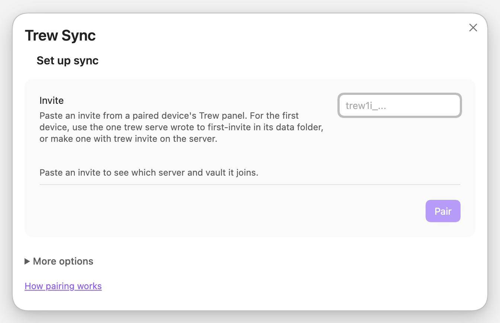
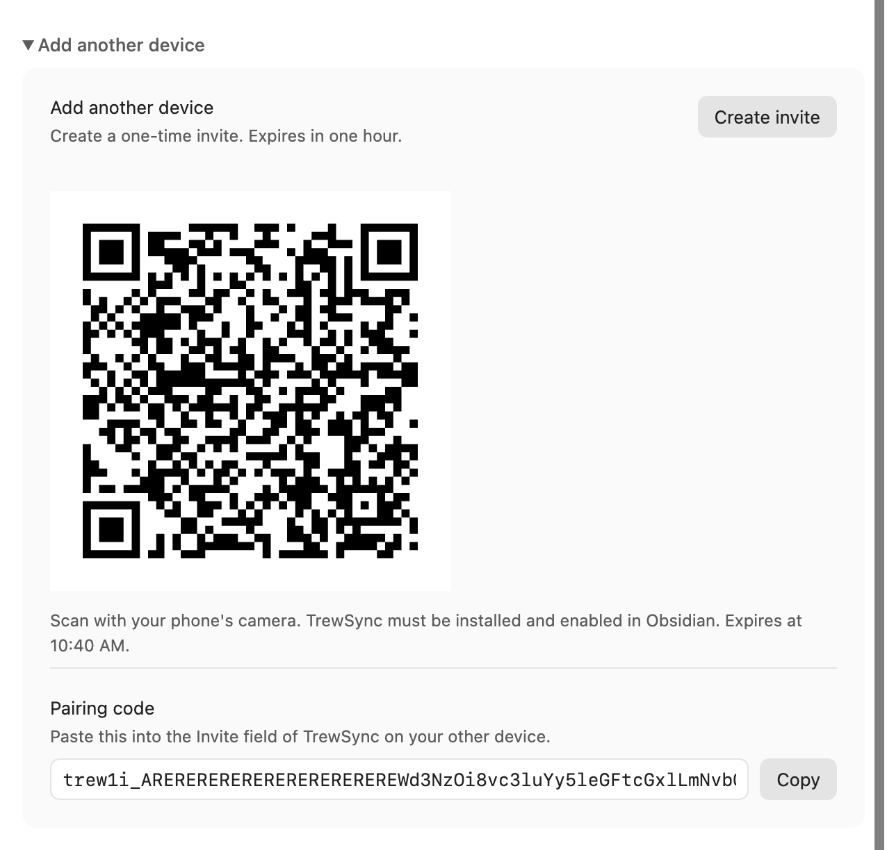
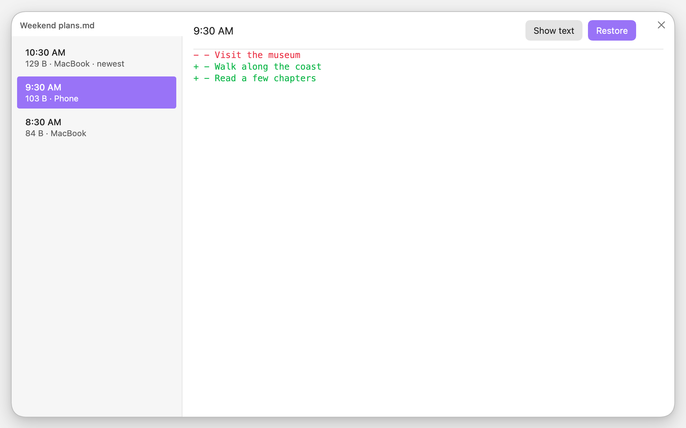
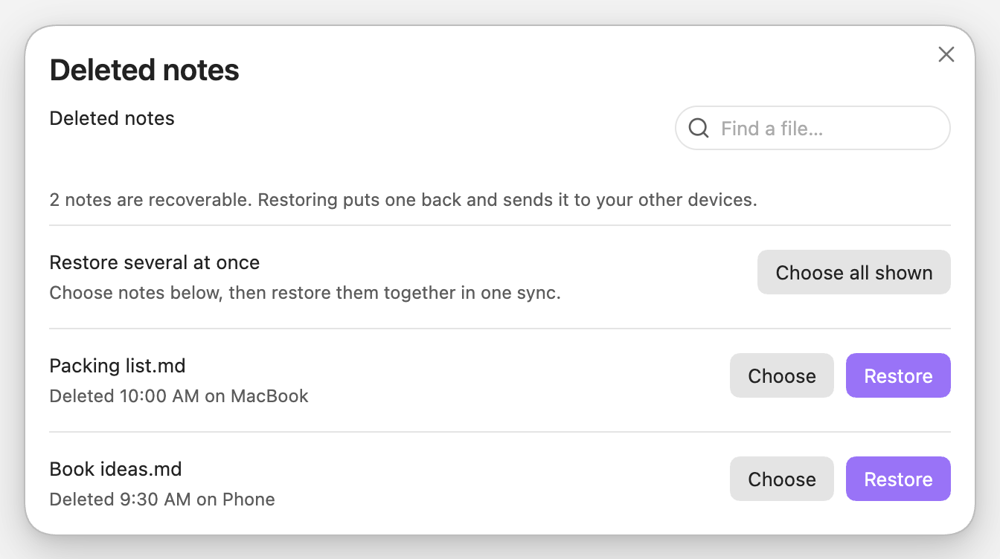
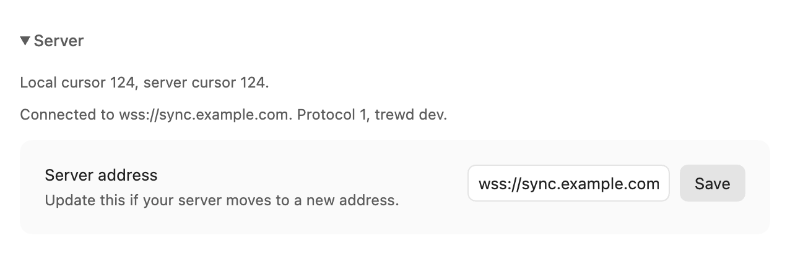
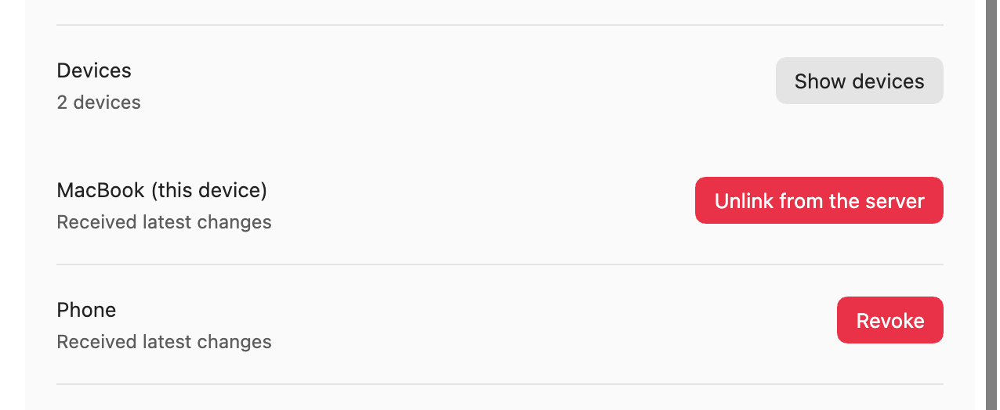

# Use Trew in Obsidian

[Documentation](index.md) · [Server setup](server.md) · [Security and privacy](security.md)

Trew syncs your notes and attachments, shows sync status, and lets you recover
earlier versions from inside Obsidian. Start with a
[configured server](server.md) and Obsidian **1.7.2 or newer**.

Use a local vault on macOS, Linux, or Android. iOS is untested; Windows is not
supported. Back up an existing vault before pairing, and disable other sync
services for that vault. Each device should have its own local copy.

## Install

1. Download `main.js`, `manifest.json`, and `styles.css` from the newest stable
   [plugin release](https://github.com/waynehoover/trew/releases).
   Plugin releases use a plain `X.Y.Z` version; skip `server/v…` and `cli/v…`.
2. Create `<vault>/.obsidian/plugins/trew-sync/` and put the three files there.
   If you use a custom Obsidian configuration folder, use that folder instead
   of `.obsidian`.
3. Reload Obsidian and enable **Trew Sync** under **Settings → Community plugins**.
4. Open the Trew ribbon icon and choose **Sync settings**, or run
   **Trew Sync: Show status** from the command palette.

Manual installation is required while Trew is outside the community directory.
To upgrade, replace the same three files and reload Obsidian. When a release
changes the protocol, upgrade the server before its clients.

## Pairing

<details>
<summary>See the setup screen</summary>

<picture>
  <source media="(prefers-color-scheme: dark)" srcset="assets/screenshots/pairing-dark.png">
  
</picture>

</details>

### Start your first device

1. Paste the server's setup string into **Invite or setup line**. With TLS
   configured, it looks like `wss://homelab.example.ts.net#TOKEN`. Trew reads
   it and says which server it will start the vault on; check that address.
2. Press **Start a new vault**, save the recovery key under **Write this down**,
   then press **I have written it down**.
3. Wait for sync to finish before adding another device.

To name this device something other than the suggestion, open **More options**
first.

Keep the recovery key somewhere safe and separate from your devices. It is how
you regain access if every device is lost; Trew cannot reissue it. Use an
invite for routine pairing.

A server using a vault name other than `default` must be initialized once with
[the CLI](server.md#a-vault-that-is-not-called-default). The plugin can then
join it with an invite.

### Add another device

1. On a paired device, open **Add another device → Create invite**.
2. On your phone, install and enable Trew, then scan the QR code. Or copy the
   pairing code and paste it into **Invite or setup line** on the new device.
3. Check the vault and server named under the field, then press **Pair**.
4. If this vault already contains files, Trew asks you to confirm combining
   them with your synced vault. An older copy can bring back files moved or
   deleted elsewhere. **Cancel** leaves your files and invite untouched.
5. If **Review your first sync** appears, review the counts and choose
   **Continue sync**. An empty vault starts downloading immediately.
   Keep Obsidian open until it finishes.

To download a fresh copy, create a new empty Obsidian vault and keep the old
vault as a backup. Trew does not clear or move existing files during pairing.

An invite works once and expires after ten minutes. If it expires, create a new
one. If no paired device remains, paste the recovery key into the same field.
There is no fixed device limit.

<details>
<summary>See the QR code and pairing code</summary>

<picture>
  <source media="(prefers-color-scheme: dark)" srcset="assets/screenshots/invite-dark.png">
  
</picture>

</details>

## What it does

Trew syncs shortly after edits and checks periodically while Obsidian is open.
It reconnects after a dropped connection. Press **Sync now** to sync immediately,
including retrying files after fixing a problem. Use **Reconnect** when offline
or **Resume sync** when paused.

Open the panel for the result and any files needing attention. It includes the
server address and version, useful when diagnosing a connection problem.
On desktop, the status bar shows a cloud with a check when synced. Hover for
details or click it for quick actions and settings.

During longer transfers, the panel shows which file is uploading or downloading
and how much data has moved. Keep Obsidian open until sync finishes.

The delivery line reports which other devices have received the latest changes.
If it is waiting for your phone, open Obsidian there. A disconnected device
cannot confirm new changes until it reconnects.

| Status | What to do |
|---|---|
| Unpaired | Pair this vault. |
| Paused | Choose **Resume sync** from the Trew menu. |
| Connecting, loading history, or syncing | Keep Obsidian open until sync finishes. |
| Synced | No outstanding work was reported. |
| Needs attention | Open the panel and follow the reason shown for each file. |
| Failed or offline | Check the connection and the reported error; Trew retries temporary failures. |
| Stopped | Follow the panel's instructions. Repeated attempts alone will not fix this condition. |

For a protocol mismatch, update the server and plugin to compatible releases.
For a restored server, use **Rejoin this server** below. If the panel reports
unreadable local state, preserve that state and your notes before attempting
recovery; deleting the plugin's files is not a general troubleshooting step.

## Activity and quick actions

Click the Trew status icon or tap its ribbon icon for **Sync activity**,
**Review conflicts**, **Preview sync**, history, and settings. **Pause sync**
stops this device until you resume it or restart Obsidian.

The activity log keeps the latest 300 events on this device across restarts.
Search by filename or filter errors and conflicts. **Copy diagnostics** omits
filenames; note contents and credentials are never recorded in this log.

Before combining populated vaults, Trew shows upload, download, and preserved-copy
counts. Deleting an entire folder containing several synced
files also opens a review. Choose **Pause sync** if the changes are unexpected.
**Preview sync** lets you inspect planned changes at other times without writing
notes. A preview is an estimate: files are checked again when sync runs.

If a file changed outside Obsidian but did not sync, run **Trew Sync: Verify
vault contents**. This reads every file again and can take longer than a normal
sync.

<details>
<summary>See activity, conflict review, and first-sync previews</summary>

- [Recent activity](assets/screenshots/activity-phone.png)
  ([dark theme](assets/screenshots/activity-phone-dark.png))
- [Compare a conflict](assets/screenshots/conflicts-phone.png)
  ([dark theme](assets/screenshots/conflicts-phone-dark.png))
- [Review first-sync changes](assets/screenshots/preview-phone.png)
  ([dark theme](assets/screenshots/preview-phone-dark.png))

These phone layouts were captured in desktop Obsidian's mobile styles.

</details>

## Version history

Run **Trew Sync: Show version history** for the open note, or use the note's
right-click menu. Choose a version to read it or compare it with the local copy.
Use **Load more** to go further back. Tab or the arrow keys move between
versions. Attachments and large notes show their details without loading a text
preview; restore a copy to open the complete file.

<picture>
  <source media="(prefers-color-scheme: dark)" srcset="assets/screenshots/changes-dark.png">
  
</picture>

**Restore does not overwrite an existing file.** If the original path is
occupied, the copy appears beside it, for example `Note (restored 42).md`.
Restoring also tries to upload the copy to the server. Other devices receive
it when they next sync.

History remains available until the server operator
[purges it](server-operations.md#purge).

## Deleted notes

Press **Browse deleted**, select the note, and restore it. A note whose
content has been purged is listed without a restore button.
Use **Show older** to browse further back and **Newest** to return. If the
connection fails, choose **Try again** after reconnecting.

<details>
<summary>See deleted notes</summary>

<picture>
  <source media="(prefers-color-scheme: dark)" srcset="assets/screenshots/deleted-dark.png">
  
</picture>

</details>

A deletion received from another device goes to the system trash, or the
vault's `.trash` if necessary. If you edit a note while another device deletes
it, Trew keeps the edit and sends it back as a new version.

## Conflicts

Trew tries to combine edits made on different devices. If its merge checks
fail, it keeps both versions, for example:

```text
Meeting notes.md
Meeting notes (Conflicted copy laptop 202608311412).md
```

Choose **Review conflicts** from the Trew menu. Compare the original and
preserved copy, then keep either one or edit a combined version. **Decide later**
leaves both files in place. If a file changes while you review it, refresh the
comparison before choosing. The result syncs to your other devices.

Attachments and large notes can be opened separately for comparison. You can
also combine files manually and delete the extra copy. Usually the incoming
version gets the conflict name; an edit made during replacement can instead be
preserved there.

Successful merges and ordinary downloads can update the original note. Keeping
both versions on a conflict is not a promise that sync never changes an open file.

## What is not synced

- Obsidian's configuration folder: settings, plugins, themes, snippets, and
  workspace layout.
- Files or folders whose names start with a dot, at any depth, including
  `.git`, `.trash`, and `.trew`.
- Files above the server's limit, **64 MiB by default**. The server operator
  can [adjust the limit](server-reference.md#serve).

Other notes and attachments are included. Large attachments need more memory,
particularly on phones.

## Phones

Android sync runs while Obsidian is **open in the foreground**. There is no
background service or push notification to wake it. Keep the screen on for a
large first sync, and let changes finish before closing the app.

iOS has not been tested. If a first connection is rejected because of its
browser origin, the panel shows an origin hint for the server operator; see
[server connection troubleshooting](server.md#connection-troubleshooting).

## Change the server address

Open **Server → Server address**, enter the new address, and press **Save**.
Trew checks the connection using this device's existing pairing before saving.
Use this when the same server moves to a new hostname or port. Notes and sync
history are kept. Update the address on each device.

<details>
<summary>See server settings</summary>

<picture>
  <source media="(prefers-color-scheme: dark)" srcset="assets/screenshots/server-dark.png">
  
</picture>

</details>

## Devices, and revoking one

Under **Manage this vault**:

- **This device's name → Rename** changes the label used for future activity.
  Existing history and conflict filenames retain their old labels.
- **Devices → Show devices** lists registered devices and outstanding invites.
- **Revoke** stops a device connecting; **Cancel** invalidates an unused invite.

When names match, the list shows device IDs to help you tell them apart.
Rows marked **Never connected** may be left by an interrupted pairing.

<details>
<summary>See the device list</summary>

<picture>
  <source media="(prefers-color-scheme: dark)" srcset="assets/screenshots/devices-dark.png">
  
</picture>

</details>

Revocation cannot erase notes or decryption keys already on a device. See
[what to do after losing a device](security.md#if-a-device-is-lost-or-stolen).
Revoking the final device requires the recovery key and the
[CLI](cli-reference.md#device-access).

<details>
<summary>Recovery and server maintenance</summary>

## Replacing the vault's secret

If your recovery key was exposed, choose **Manage this vault → Replace the
vault's secret**, provide the current recovery key, and follow the confirmation.
Save the new key. If the result is uncertain, keep both keys and follow the
message before discarding either.

This replaces the recovery key and cancels outstanding invites. Existing
devices keep syncing and history remains available. It does not revoke those
devices or replace the data-encryption key. Review
[the privacy limits](security.md#if-a-device-is-lost-or-stolen) before relying
on it after a theft.

## Rejoining a restored server

After the server is restored from an older backup, the panel may show
**Stopped** and offer **Rejoin this server**.

First have the operator back up the restored server and preserve local notes.
Press **Rejoin this server**, review the two positions shown, then confirm.
Trew rejoins and sends versions held only on this device, keeping both copies
where they disagree. Prefer this action to unlinking and pairing again.

## Sending back what the server has lost

If the operator confirms that the server is missing stored content, choose
**Manage this vault → Send back what the server has lost** on a device that
still has the notes. Trew resends missing content without creating new note
versions.

Repeat on other devices that may have additional copies. The operator should
then run `trew verify`; a successful repair on one device cannot establish
that all server history is recoverable.

## Durability

Trew stages incoming files and checks the written bytes before putting them
in place. Desktop and mobile provide different guarantees during a power loss;
keep independent backups of your notes.

If the panel says **versions were kept somewhere Obsidian does not show**, keep
the named files and the plugin's state folder. The notice gives their retained
locations. Copy a retained version to a new visible note and check it before
removing any recovery material. Do not clear hidden files as a general cleanup.
The [technical design](design.md#file-replacement) explains these paths.

</details>

## Unlink

**Manage this vault → Unlink this vault** stops syncing here and removes the
local pairing and sync index. Your notes remain on this device and the server.
Pair again to resume. Unlinking locally does not revoke the server's device
record; use **Devices** when you want to remove access.

## Commands

| Command-palette action | Result |
|---|---|
| Trew Sync: Sync now | Run a sync. |
| Trew Sync: Verify vault contents | Re-read every file, then sync. |
| Trew Sync: Preview sync | Review planned changes without writing notes. |
| Trew Sync: Show sync activity | Search recent activity. |
| Trew Sync: Review conflicts | Compare and resolve preserved copies. |
| Trew Sync: Pause or resume sync | Stop or restart syncing on this device. |
| Trew Sync: Show status | Open the panel. |
| Trew Sync: Show version history | View history for the open note. |
| Trew Sync: Recover a deleted note | Browse deleted notes. |
